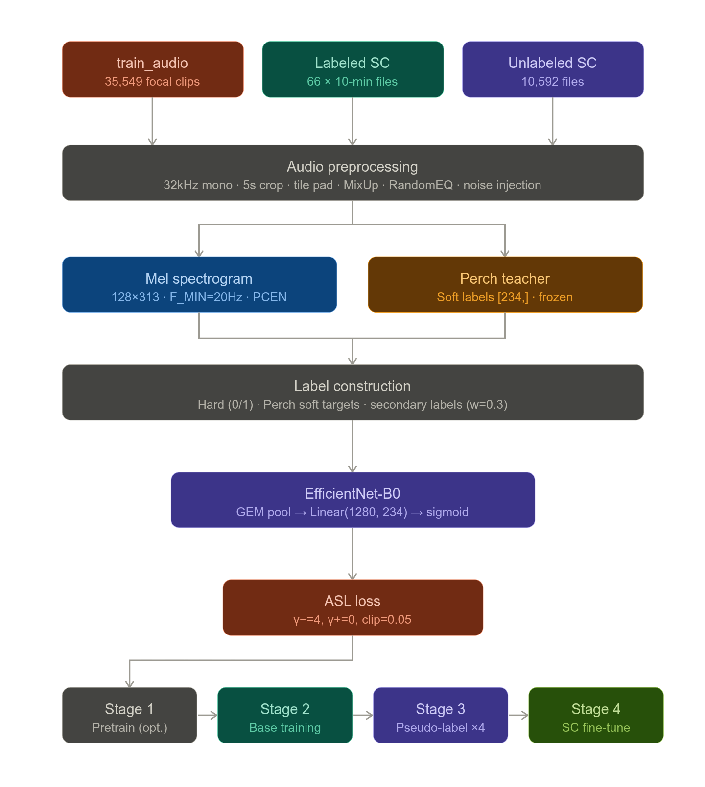
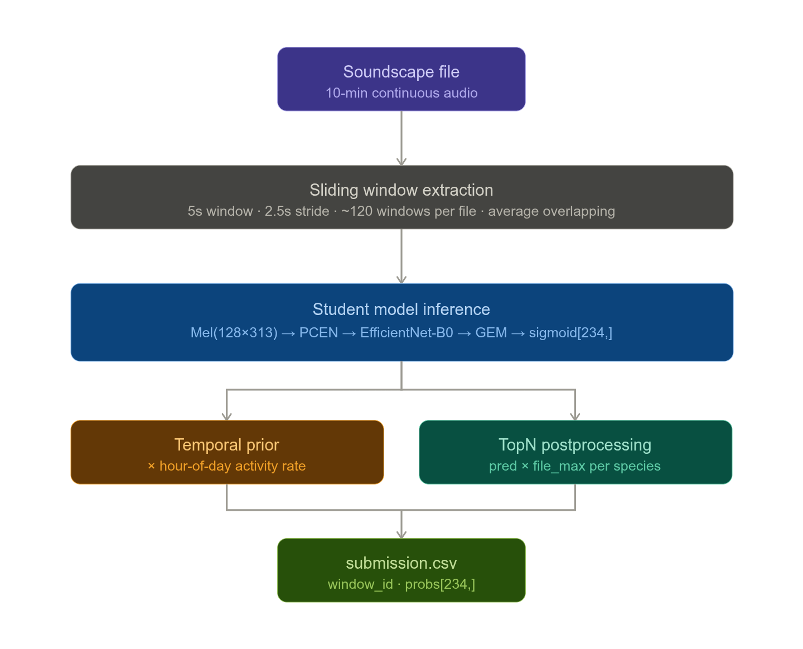

> **Competition:** https://www.kaggle.com/competitions/birdclef-2026  
> **Team:** Gaurav Upreti  
> **Last updated:** March 2026


## 1. Competition Overview

BirdCLEF+ 2026 is **not a bird-only competition**. The `+` marks an expansion — the task is to classify all vocalizing wildlife from 5-second audio windows cut from continuous Pantanal soundscape recordings. The model must handle birds, frogs, mammals, reptiles, and insects simultaneously.

- **Metric:** Macro ROC-AUC across all 234 species. Every species counts equally regardless of training data size.
- **Inference constraint:** CPU-only, 90-minute runtime limit for the submission notebook.
- **Training:** Unconstrained — use any GPU notebook, any model size, any duration.
- **Prize:** $45,000 total. Additional $5,000 for best working notes (deadline June 17, 2026).
- **Final deadline:** June 3, 2026.

---

## 2. Dataset Structure

```
/kaggle/input/birdclef-2026/
├── train_audio/                   35,549 focal recordings (.ogg)
├── train_metadata.csv             labels + metadata for train_audio
├── taxonomy.csv                   234 species: eBird codes, iNat IDs, class names
├── train_soundscapes/             ~10,658 continuous 10-min Pantanal recordings
├── train_soundscapes_labels.csv   ground-truth for 66 labeled soundscapes (5s windows)
├── test_soundscapes/              unlabeled test files (currently empty pre-release)
└── sample_submission.csv          expected output format
```

### train_metadata.csv columns
`primary_label`, `secondary_labels`, `type`, `latitude`, `longitude`, `scientific_name`, `common_name`, `class_name`, `inat_taxon_id`, `author`, `license`, `rating`, `url`, `filename`, `collection`

### train_soundscapes_labels.csv format
```
filename                                    start     end       primary_label
BC2026_Train_0039_S22_20211231_201500.ogg  00:00:00  00:00:05  22961;23158;24321;517063
```
- Semicolon-separated species per 5s window
- **739 duplicate rows** — always apply `.drop_duplicates()` on load
- Filename encodes: recorder ID, site ID, date (YYYYMMDD), time (HHMMSS)

### Data loading gotchas
- `secondary_labels` column stores Python list strings like `"['compau', 'saffin']"` — use `ast.literal_eval()` to parse
- Some secondary labels are iNat numeric IDs (e.g. `'326272'`) not eBird codes — cross-reference via `taxonomy.csv` `inat_taxon_id`
- `rating` column: XC recordings rated 0–5, all iNat recordings default to `0.0` (not low quality, just unrated)
- `date` column does **not exist** in `train_metadata.csv` — dates extractable from soundscape filenames only

---

## 3. Species & Taxonomy

234 target species across 5 taxonomic classes:

| Class | Species | Train Recordings | Median clips/species | Notes |
|---|---|---|---|---|
| Aves | 162 | 34,799 | 168 | Birds — dominant class |
| Amphibia | 32 | 451 | 7 | Frogs — critically underrepresented |
| Insecta | 3 (+ 25 sonotypes) | 199 | 11 | Includes unnamed sonotypes |
| Mammalia | 8 | 99 | 7.5 | |
| Reptilia | 1 | 1 | 1 | Single caiman recording |

**206 species have train_audio clips. 28 species have zero training clips** (see Section 11).

**train_metadata vs taxonomy gap:** `taxonomy.csv` has 234 species, `train_metadata.csv` has 206. The 28 missing species appear only in soundscape labels or not at all.

---

## 4. Class Imbalance

```
Total recordings  : 35,549
Total species     : 206
Mean/species      : 172.6
Median/species    : 125.0
Max               : 499 (rubthr1 — Rufous-bellied Thrush)
Min               : 1
Gini coefficient  : 0.490  (moderate — better than prior BirdCLEF years)
Top-10 species    : 13.9% of all recordings
```

### Rarity tiers

| Tier | Aves | Amphibia | Mammalia | Insecta | Reptilia |
|---|---|---|---|---|---|
| Critical (<10) | 1 | 18 | 4 | 1 | 1 |
| Rare (10–49) | 9 | 13 | 4 | 1 | 0 |
| Moderate (50–149) | 62 | 1 | 0 | 0 | 0 |
| Common (≥150) | 90 | 0 | 0 | 1 | 0 |

**Not a single Amphibia species has ≥150 recordings. 18/32 frog species are critical tier.**

### Modeling implications
- Use `WeightedRandomSampler` with weight ∝ `1/sqrt(class_count)`
- Upsample classes with <100 samples to minimum 100
- Stratify CV folds by `class_name` first, then `primary_label`
- Focal loss (γ=2) or ASL loss (γ−=4, γ+=0) — do NOT use plain BCE

---

## 5. Secondary Labels

- 12.3% of train recordings have at least one secondary (background) species label
- Mean 0.21 secondary labels per recording, max 15
- Secondary label rate: Aves 12.5%, Amphibia 2.9%, Mammalia 1.0%, Insecta/Reptilia 0%
- **0 secondary-only species** — every background species also has primary training data
- Top background species: Great Kiskadee (624 clips), White-tipped Dove (468), Undulated Tinamou (315)

### Modeling implication
Treat secondary labels as soft targets (0.3 weight, not 1.0) rather than ignoring them.

---

## 6. Geographic Analysis

**Critical finding: training data is globally distributed, not Pantanal-specific.**

```
Median distance from Pantanal centroid (-17.0, -57.5): 1,663 km
Only ~4% of recordings inside Pantanal core bounding box
Continent breakdown: 56% South America, 28% Central America, 14% North America, 2% other
```

The organizers collected recordings of Pantanal species from wherever those species were recorded worldwide (XenoCanto + iNaturalist globally). A Great Kiskadee recorded in Louisiana sounds identical to one in Brazil.

**Consequence: geographic features are useless for modeling.** Drop `latitude`, `longitude`, `dist_pantanal_km` entirely from any feature set.

### Collection sources

| Source | Recordings | Rating system | Characteristics |
|---|---|---|---|
| XenoCanto (XC) | 23,043 (64.8%) | 0–5 quality scale | Expert birders, longer clips, proper equipment |
| iNaturalist (iNat) | 12,506 (35.2%) | Always 0.0 | Citizen science, short clips, phone microphones |

**Rating is fully confounded with collection source** — every iNat recording has rating 0.0 not because it's bad but because iNat doesn't use XC's rating system. You cannot use rating as a quality filter without losing all iNat data.

### Geographic outlier species (Africa/Asia/Europe)
These have recordings outside their native range — cosmopolitan species or captive animals:

| Species | Count | Type |
|---|---|---|
| House Sparrow | 257 | Cosmopolitan — valid |
| Red Junglefowl | 187 | Captive birds in Asia — noise |
| Striated Heron | 75 | Cosmopolitan — valid |
| Osprey | 59 | Cosmopolitan — valid |
| Domestic Dog | 40 | Background noise mislabeled as species |
| White-faced Whistling Duck | 62 | Africa + S.America range — valid |

Domestic Dog recordings are the most problematic — a barking dog got labeled as a species. Down-weight via `sample_weight` rather than deleting.

---

## 7. Audio File Properties

All confirmed from Phase 4 header scan on full dataset:

```
Sample rate      : 32,000 Hz — 100% of files, no resampling needed
Median duration  : ~20–25s (XC), ~5–15s (iNat)
Channels         : mix of mono and stereo — convert stereo to mono
File format      : .ogg (Ogg Vorbis)
```

### Duration findings
- iNat clips peak sharply at 5–15s then drop off (phone recordings)
- XC clips have flat distribution up to 120s (deliberate field recordings)
- Spike at exactly 120s in XC = recordings were truncated at that length
- Many Amphibia clips are **under 5 seconds** — shorter than one scoring window

### Corrupted files (known)
These are under 1 second and contain no useful audio:
```
209233/iNat1545859.ogg
47144/iNat1191939.ogg
47144/iNat1317365.ogg
47144/iNat1317366.ogg
```
Filter these out before training.

---

## 8. Audio Domain Knowledge

### The processing pipeline
```
Raw waveform (160,000 samples @ 32kHz for 5s)
  → STFT (N_FFT=2048, HOP_LENGTH=512)
  → Mel filterbank (N_MELS=128, F_MIN=20, F_MAX=16000)
  → PCEN normalization
  → CNN backbone
  → GEM pooling
  → Classification head (234-class sigmoid)
```

### Confirmed mel spectrogram config (from Phase 4 + 2025 2nd place paper)
```python
TARGET_SR      = 32000    # no resampling needed — all files at this rate
CHUNK_DURATION = 5.0      # seconds per training chunk
N_FFT          = 2048     # frequency resolution (was 1024 — upgrade)
HOP_LENGTH     = 512      # ~16ms hop (was 320 — upgrade)
N_MELS         = 128      # mel frequency bins
F_MIN          = 20       # Hz — captures frog low-frequency fundamentals
F_MAX          = 16000    # Nyquist for 32kHz
TOP_DB         = 80       # clip dynamic range
# Output shape per 5s chunk: 128 × 313 time frames
```

**Why F_MIN=20 not 50:** Standard BirdCLEF configs use F_MIN=50 which cuts off frog call fundamentals at 200–500Hz. This competition requires the full frog frequency range.

### PCEN vs log-mel normalization
PCEN (Per-Channel Energy Normalization) is critical — removing it caused -0.049 val AUC in experiments (early stop at epoch 3). Standard log-mel normalization cannot adapt to varying noise floors across different recorders.

PCEN does three things: adaptive gain control (removes dynamic background noise), root compression (softer than log), bias term (prevents division by zero). Use `torchaudio.transforms.PCEN`.

**Never quantize the PCEN layer** — keep in FP32. Only quantize CNN body layers.

### Short clip handling — tile padding
For clips shorter than 5 seconds (common for Amphibia), do NOT zero-pad. Use tile/repeat padding:
```python
def load_chunk(path, target_len=32000*5):
    y, _ = librosa.load(path, sr=32000, mono=True)
    if len(y) < target_len:
        y = np.tile(y, (target_len // len(y)) + 1)[:target_len]
    return y
```

### GEM pooling
Generalized Mean Pooling: `(mean(x^p))^(1/p)`. Use `p_init=3.0`. Applied across frequency axis then time axis. Focuses on the most "birdlike" time frames rather than averaging over silence. Standard in all top BirdCLEF solutions.

### Loss functions
- **ASL (Asymmetric Loss):** `γ−=4, γ+=0, clip=0.05` — strongly down-weights easy negatives (the 229+ absent species per clip). Confirmed better than BCE. Standard in current top solutions.
- **SoftAUCLoss:** directly optimizes macro ROC-AUC. Use in later pseudo-label training rounds, not from scratch.
- **CrossEntropy + label smoothing (α=0.05):** good starting loss for early training, better than BCE.

### SNR measurements
```
XC high quality (rating ≥4)  : ~10.3 dB
iNat (unrated)               : ~7.1 dB
Amphibia clips               : ~10.3 dB (surprisingly clean)
Soundscape chunks            : lower than both
```
The 3.2 dB XC→iNat gap should be bridged with noise augmentation (+2–4 dB to XC clips during training).

---

## 9. Soundscape Analysis

### Label structure
```python
sc_labels = pd.read_csv("train_soundscapes_labels.csv").drop_duplicates()
# 739 rows after dedup (was 1478 with duplicates)
# 66 labeled soundscape files, 75 unique species
# Mean 4.22 species per 5s window (max 10)
```

### Time of day distribution — stark finding
```
Evening (18–24h) : Amphibia 2,574 windows | Aves 174 windows
Night   (0–6h)  : Amphibia 776 windows   | Aves 560 windows
Morning (6–12h) : Amphibia 0 windows     | Aves 34 windows
```

**Frogs outnumber birds 15:1 in the evening. The recorders run overnight.** The model trained 98% on bird clips will be evaluated mostly on frog windows.

### Top 20 soundscape species
8 of the top 10 are Amphibia:

| Rank | Species | Class | Windows |
|---|---|---|---|
| 1 | Dwarf Tree Frog | Amphibia | 666 |
| 2 | Whistling Grass Frog | Amphibia | 426 |
| 3 | Chaco Tree Frog | Amphibia | 420 |
| 4 | Pale-legged Weeping Frog | Amphibia | 350 |
| 5 | Lesser Snouted Tree Frog | Amphibia | 346 |
| 6 | Mato Grosso Snouted Tree Frog | Amphibia | 344 |
| 7 | Marbled White-lipped Frog | Amphibia | 310 |
| 8 | Paraguayan Swimming Frog | Amphibia | 298 |
| 9 | Chaco Chachalaca | Aves | 130 |
| 10 | White-tipped Dove | Aves | 126 |
| 19 | Domestic Dog | Mammalia | 30 |

### Soundscape coverage gap
Only 66 of 10,658 soundscape files are labeled (0.6%). The remaining 10,592 files are unlabeled Pantanal audio from the exact same domain as the test set — the primary resource for pseudo-labeling.

---

## 10. Domain Shift

The core challenge: train_audio are short focal recordings (someone pointed a mic at one animal). Test soundscapes are 10-minute ambient recordings with multiple overlapping species and variable SNR.

Key differences:
- Mean 4.22 species active simultaneously in soundscapes vs 1–2 in focal recordings
- Soundscape SNR lower than both XC and iNat train clips
- Soundscape recordings are from 9 specific Pantanal sites (recorders), train_audio is from globally distributed locations
- Soundscapes are nocturnal/crepuscular only — no midday recordings

### Inference strategy for soundscapes
```python
# Slide 5s window with 2.5s overlap (50%) across full soundscape
# Average logits across overlapping windows per 5s scoring period
# TopN postprocessing: multiply by file-level max per species
# Energy gate: suppress predictions where RMS < noise floor threshold

# TopN postprocessing (confirmed +0.011 LB — free win)
file_max = preds.max(axis=0, keepdims=True)
preds_postproc = preds * file_max
```

---

## 11. Zero-Shot Species Problem

**37% of soundscape species (28/75) have zero training clips anywhere.**

### The 25 insect sonotypes
```
47158son01 through 47158son25
```
These are acoustically-defined categories for insects the organizers couldn't identify to species level. They exist ONLY in `train_soundscapes_labels.csv` — zero entries in XenoCanto or iNaturalist. **1,136 of 1,478 soundscape windows (77%) contain at least one insect sonotype.**

All share `inat_taxon_id = 47158` (a beetle family) and are labeled `class_name = Insecta`.

### Additional zero-shot species
- `1491113` — Guaraní leaf-litter frog (Amphibia) — in taxonomy + soundscapes, no train clips
- `517063` — Southern Orange-legged Leaf Frog (Amphibia) — in taxonomy + soundscapes, no train clips

### Soundscape coverage summary
```
≤ 0 train clips : 28 species (37% of soundscape species)
≤ 5 train clips : 32 species (43%)
≤ 10 train clips: 36 species (48%)
≤ 50 train clips: 47 species (63%)
```

### Strategy for zero-shot species
The insect sonotypes can only be learned from the soundscape labels themselves — extract those windows, compute embeddings (Perch or your own model), cluster into 25 categories matching the `son01`–`son25` labels. This is an unsupervised learning problem embedded inside a supervised competition.

---

## 12. Leaderboard Context

| Approach | LB Score |
|---|---|
| Google Perch (off-the-shelf, covers 203/234 species) | 0.825 |
| Single EfficientNet-B0 SED | ~0.849 |
| SED + soundscape pseudo-labels | ~0.878 |
| Perch soft distillation + kitchen-sink augmentation | **0.894** (March 19) |
| BirdCLEF 2025 1st place equivalent (target) | ~0.930 |

### 2025 top solution techniques (confirmed effective)
From the 2025 1st place (public 0.933 / private 0.930):
- PowerTransform pseudo-labels × 4 rounds: `pseudo_probs = pseudo_probs ** gamma` — prevents probability collapse
- SoftAUCLoss for later pseudo-label rounds
- Separate non-bird sub-pipeline (+0.003 LB)
- StochasticDepth (`drop_path_rate=0.2`) during pseudo-label training
- Model soup: average last 3–5 epoch checkpoints

From the 2025 2nd place (private 0.928):
- Audio-domain MixUp (not spectrogram-domain): confirmed +0.036 private LB
- RandomFiltering augmentation (random biquad EQ): +~1% private LB
- OOF pseudo-labeling to avoid label leakage
- TopN(N=1) postprocessing: +0.011 LB
- 819K-recording pretraining on all prior BirdCLEF data: +0.014 LB
- GeM frequency pooling

### Confirmed anti-patterns (from live experiments)
```
Rating ≥ 3 filter         : -0.047 val AUC (removes useful low-quality signal)
Removing PCEN             : -0.049 val AUC (CRITICAL — do not remove)
Perch-augmented training  : -0.039 val AUC (use Perch as teacher, not augmenter)
V2S backbone (low LR)     : underperforms B0 (fix: use LR=5e-4, same as B0)
FP16 on CPU               : SLOWER than FP32 on most CPUs (no AVX-512 FP16 support)
```

---





## 13. Architecture Direction

### Novel tri-branch architecture (in development)

The core insight: current top solutions use a single mel spectrogram config that's a compromise. Different taxonomic classes vocalize in different frequency ranges. Separate frequency-specialized branches give each CNN a spectrogram optimally configured for the species it needs to learn.

```
Frequency ranges by class:
  Amphibia / Insecta  : 20 Hz – 2,000 Hz  (fundamentals + harmonics)
  Aves (most)         : 500 Hz – 8,000 Hz  (majority of bird calls)
  Aves (high-pitched) : 2,000 Hz – 16,000 Hz (hummingbirds, some owls)
```

### Proposed architecture
```
Raw audio (32kHz, 5s)
       ↓           ↓            ↓
  Low-freq mel  Mid-freq mel  High-freq mel
  (20–2000Hz)   (500–8000Hz)  (2000–16kHz)
       ↓              ↓             ↓
  GhostNetV2/V3  EfficientNetV2-S  ShuffleNetV2
  (frogs/insects) (birds — main)   (high birds)
       ↓              ↓             ↓
  GEM pool       GEM pool       GEM pool
  256-d          512-d          256-d
       ↓              ↓             ↓
       └──────── Cross-branch ──────┘
                 attention fusion
                   1024-d
                ↓           ↓
          Non-bird head   Bird head
           (72 species)  (162 species)
                └─────────┘
              234-class sigmoid output
```

### Backbone selection (finalized)

| Branch | Student (inference) | Teacher (training only) |
|---|---|---|
| Low-freq | GhostNetV2/V3 (7.3M, 14–18ms) | EfficientNetV2-L |
| Mid-freq | EfficientNetV2-S (22M, 90ms) | EfficientNetV2-L + AST-Base |
| High-freq | ShuffleNetV2 (2.3M, 6ms) | EfficientNetV2-L |
| Fusion | 4-layer tiny transformer (3M, 5ms) | — |

**Total inference: ~119ms/window × 7,200 windows = ~14 minutes. 76 minutes headroom.**


## Initial Experiment List — Ordered by Priority

The rule: one change per experiment, record all 5 numbers (overall, Aves, Amphibia, Insecta AUC + soundscape val).

---

### Phase 1 — Get a number on the board (Week 1)

| # | Experiment | Expected Gain | Effort | Why |
|---|---|---|---|---|
| E01 | EfficientNet-B0 + BCE + hard labels | Baseline | 1 day | Establish your zero-point |
| E02 | Switch BCE → ASL (γ−=4, γ+=0) | +0.010–0.015 | 30 min | Confirmed in your README |
| E03 | F_MIN=50 → F_MIN=20 | +0.005–0.010 | 5 min | 1 config line, helps frogs directly |
| E04 | Add tile padding for short clips | +0.003–0.005 | 30 min | Prevents zero-pad artifacts in frogs |
| E05 | Add weighted sampling (1/sqrt) | +0.005–0.010 | 1 hour | Forces model to see rare species |

Run E01 first. Every subsequent experiment is measured against E01's scores.

---

### Phase 2 — Augmentation stack (Week 1–2)

| # | Experiment | Expected Gain | Effort | Why |
|---|---|---|---|---|
| E06 | Audio-domain MixUp (α=0.5) | +0.025–0.036 | 2 hours | Biggest single augmentation gain — 2025 2nd place |
| E07 | Add SpecAugment (time + freq mask) | +0.005–0.010 | 1 hour | Standard, well-validated |
| E08 | Add RandomFiltering (random biquad EQ) | +0.008–0.012 | 2 hours | 2025 2nd place confirmed this |
| E09 | Add random gain ±6dB | +0.003–0.005 | 30 min | Bridges XC/iNat SNR gap |

Do E06 before anything else in this phase. If E06 + E07 + E08 compound, your augmentation stack alone should move you ~0.040 AUC.

---

### Phase 3 — Perch teacher + CV setup (Week 2)

| # | Experiment | Expected Gain | Effort | Why |
|---|---|---|---|---|
| E10 | Set up held-out soundscape val set (10 files) | measurement | 2 hours | You need this before pseudo-labeling |
| E11 | Run Perch on all train_audio → save soft labels | +0.010–0.020 | 3 hours | Teacher labels are free signal |
| E12 | Train with Perch soft labels (KL loss blend) | +0.010–0.020 | 2 hours | Adds inter-species similarity knowledge |
| E13 | TopN postprocessing at inference | +0.011 | 1 hour | Free win — confirmed +0.011 LB |

E13 costs almost nothing. Do it immediately after E01. There is no reason not to.

---

### Phase 4 — Soundscape domain adaptation (Week 3)

| # | Experiment | Expected Gain | Effort | Why |
|---|---|---|---|---|
| E14 | Fine-tune on 66 labeled soundscapes (Stage 2) | +0.015–0.025 | 2 hours | First exposure to Pantanal domain |
| E15 | Temporal prior postprocessing (Method 1) | +0.008–0.015 | 3 hours | Build hour-of-day activity prior from labeled SC |
| E16 | Pseudo-label round 1 (threshold=0.3) | +0.020–0.030 | 4 hours | The biggest domain adaptation lever |
| E17 | PowerTransform on pseudo-labels (γ=2) | prevents collapse | 30 min | Do this WITH E16, not after |

E14 and E16 will be your biggest LB jumps. Watch the soundscape val score — if it doesn't move after E14, something is wrong with the fine-tuning setup.

---

### Phase 5 — Architecture and paper contributions (Week 4+)

| # | Experiment | Expected Gain | Effort | Why |
|---|---|---|---|---|
| E18 | Cyclic time encoding as model input (Method 2) | +0.005–0.012 | 4 hours | Paper contribution over Method 1 |
| E19 | OOF pseudo-labeling round 2 | +0.005–0.010 | 6 hours | Principled semi-supervised — paper contribution |
| E20 | SoftAUCLoss in pseudo-label round 3–4 | +0.010–0.015 | 3 hours | Directly optimizes metric |
| E21 | Sonotype extraction + embedding classifier | unknown | 1 day | Zero-shot insects — paper novelty |
| E22 | Temporal gating layer (Method 3) | unknown | 1 day | Paper's novel architecture contribution |
| E23 | Model soup (avg last 3 checkpoints) | +0.003–0.008 | 1 hour | Free, always do before final submit |


### Training recipe (multi-teacher distillation)
```
Stage 1 — Pretrain (optional but +1–2% AUC):
  Download all BirdCLEF 2021–2025 data
  Pretrain each branch backbone on prior-year species

Stage 2 — Base training:
  Loss: CrossEntropy + label smoothing 0.05
  Each branch trained independently on its frequency range
  Data: train_audio + train_soundscapes labels (×5 oversample)
  Augmentation: SpecAugment (time + freq mask) + circular shift
                + audio-domain MixUp (α=0.5) + random gain (±6dB)
                + RandomFiltering (random biquad EQ, p=0.5)
                + background noise from soundscape files

Stage 3 — Pseudo-labeling (4 rounds):
  Round 1: Generate soft labels from Perch on all 10,658 soundscapes
  Round 2: Student model → OOF pseudo-labels, PowerTransform (γ=2)
  Round 3: Stronger student → re-label with higher confidence threshold
  Round 4: SoftAUCLoss + StochasticDepth (drop_path_rate=0.2)
  Each round: filter pseudo-labels where max_prob < 0.5

Stage 4 — Fine-tune on soundscape domain:
  Use train_soundscapes_labels.csv as primary fine-tuning data
  These are from exact Pantanal recording sites — highest quality domain match
  Freeze early layers, train head + last 2 blocks
```

### Inference optimization stack
```
PyTorch FP32
  → ONNX export (operator fusion, constant folding)
  → INT8 static quantization with per-channel calibration
     (calibrate on train_soundscape chunks — same domain as test)
     (exclude PCEN and classifier head from quantization)
  → ONNX Runtime with 4 threads, batch_size=64
  → Optional: OpenVINO for additional 20–30% on Intel CPUs

WARNING: FP16 is SLOWER than FP32 on standard Kaggle CPUs.
         Skip FP16, go straight FP32 → INT8.

WARNING: EfficientNet Swish activations produce wide output ranges.
         Use per-channel quantization (not per-tensor) to avoid accuracy drop.
         Without this, accuracy can drop from 75% to 46% (documented issue).
```

---

## 14. Critical Numbers Quick Reference

```
Total species                           : 234
Species with train_audio clips          : 206
Species with zero training data         : 28 (25 insect sonotypes + 2 frogs + 1 unknown)
Soundscape species with <10 train clips : 36 (48%)

Total train recordings                  : 35,549
XenoCanto recordings                    : 23,043 (rated)
iNaturalist recordings                  : 12,506 (all rating=0.0)

Sample rate (all files)                 : 32,000 Hz
Scoring window                          : 5 seconds
Spectrogram shape (5s, confirmed config): 128 × 313

Mean species per soundscape window      : 4.22
Max species in one window               : 10
Soundscape windows with insect sonotype : 77% (1,136 / 1,478)
Labeled soundscapes                     : 66 / 10,658 (0.6%)

Amphibia median clips/species           : 7 (vs Aves 168)
Gini coefficient                        : 0.490

XC mean SNR                             : 10.3 dB
iNat mean SNR                           : 7.1 dB
Augmentation noise target               : +2–4 dB to XC clips

Current best LB                         : 0.894
Perch baseline LB                       : 0.825
2025 1st place equivalent               : ~0.930
```

---

## 15. Known Data Issues

| Issue | Detail | Action |
|---|---|---|
| Duplicate soundscape labels | 739 duplicates in 1,478 rows | `.drop_duplicates()` on load |
| Corrupted <1s clips | 4+ known iNat files | Filter `duration_s < 1.0` |
| secondary_labels mutation | Column gets overwritten in memory | Reload from CSV before parsing |
| rating confounded with collection | iNat always 0.0 | Never use rating as hard filter |
| Domestic Dog species (47144) | Background noise mislabeled | Down-weight via sample_weight |
| Red Junglefowl outside range | Captive birds in Asia | Flag as geo_outlier |
| inat_taxon_id as secondary label | Numeric strings like '326272' | Map via taxonomy.csv |

---


*EDA conducted March 2026. Architecture design in progress — see Phase 8 (pending).*